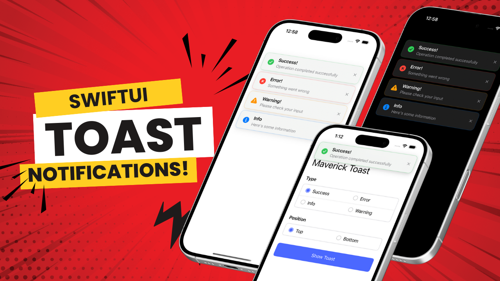

# 🎉 MaverickToast

**A professional toast notification system for SwiftUI that appears above everything - sheets, alerts, and all presentations!**



## 📺 Video Tutorial

[](https://www.youtube.com/watch?v=Sj6hG3OSVX0)

**⚠️ Important Note:** The YouTube tutorial demonstrates the SwiftUI overlay approach for learning purposes. This GitHub repository contains the **advanced UIWindow-based implementation** that displays toasts above sheets, alerts, and all app presentations!

---

## ✨ Features

- ✅ Appears above sheets, fullScreenCovers, and alerts
- ✅ Beautiful spring animations
- ✅ Auto-dismiss with customizable duration
- ✅ Multiple toast types (Success, Error, Warning, Info)
- ✅ Top and bottom positioning
- ✅ Fully customizable styling
- ✅ Global singleton manager
- ✅ Works in both SwiftUI and UIKit apps

---

## 🚀 Installation

1. Download or clone this repository
2. Copy the following files to your project:
   - `Models/ToastMessage.swift`
   - `Components/ToastView.swift`
   - `Managers/ToastManager.swift`

---

## 📖 Usage

### Basic Usage

```swift
// Show success toast
ToastManager.shared.showSuccess(
    title: "Success!",
    message: "Operation completed successfully"
)

// Show error toast
ToastManager.shared.showError(
    title: "Error!",
    message: "Something went wrong"
)

// Show warning toast
ToastManager.shared.showWarning(
    title: "Warning!",
    message: "Please check your input"
)

// Show info toast
ToastManager.shared.showInfo(
    title: "Info",
    message: "Here's some information"
)
```

### Advanced Usage

```swift
// Custom duration and position
ToastManager.shared.showSuccess(
    title: "Done!",
    message: "File uploaded",
    duration: 5.0,
    position: .bottom
)

// Custom toast with full control
let customToast = ToastMessage(
    title: "Custom Toast",
    message: "With custom settings",
    type: .success,
    duration: 4.0,
    position: .top
)
ToastManager.shared.display(customToast)
```

---

## 🎨 Customization

### Toast Types

- `.success` - Green with checkmark icon
- `.error` - Red with X icon
- `.warning` - Orange with warning icon
- `.info` - Blue with info icon

### Positions

- `.top` - Appears at the top of the screen
- `.bottom` - Appears at the bottom of the screen

---

## 🔧 How It Works

This implementation uses a **UIWindow-based approach** to display toasts:

1. Creates a separate UIWindow with elevated window level (`.alert + 1`)
2. Window is transparent and non-interactive (doesn't block touches)
3. Hosts SwiftUI toast views using UIHostingController
4. Automatically appears above all presentations including sheets and alerts

This is the same technique iOS uses for system-level notifications!

---

## 🎓 Learn More

Watch the full tutorial on YouTube to learn how to build this from scratch:
[Elevate Your SwiftUI Apps with Professional Toast Notifications](https://www.youtube.com/watch?v=Sj6hG3OSVX0)

---

## 📄 License

This project is available for personal and commercial use. Attribution appreciated but not required.

---

## 💬 Support

- 📷 Instagram: [@maverickcodebase](https://www.instagram.com/maverickcodebase/)
- 💻 Patreon: [maverickcodebase](https://www.patreon.com/c/maverickcodebase)
- 📧 Issues: [GitHub Issues](https://github.com/maverickcodebase/MaverickToast/issues)

---

## 🌟 Show Your Support

If you find this useful, please give it a ⭐️ on GitHub and subscribe to my [YouTube channel](https://www.youtube.com/@MaverickCodebase)!
